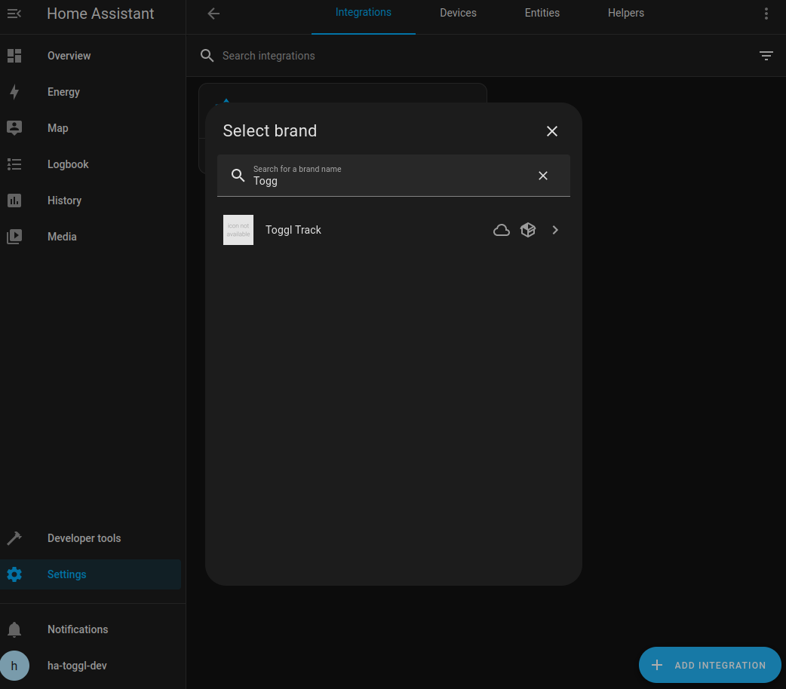
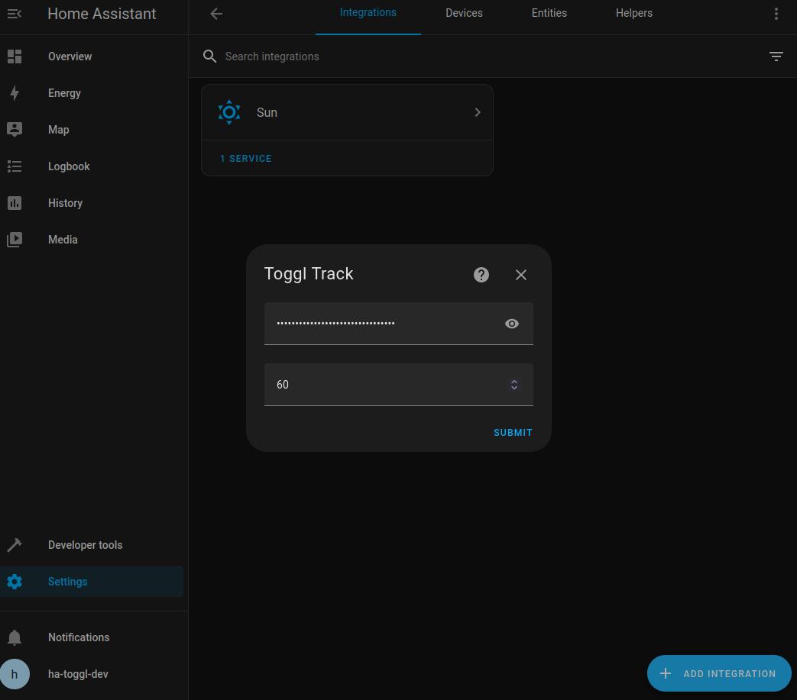
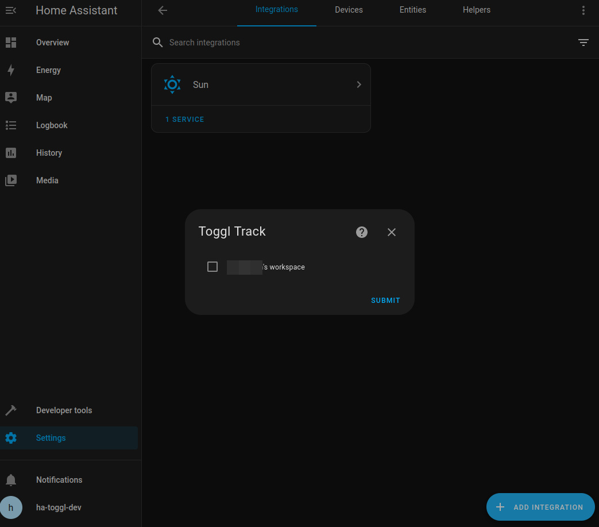
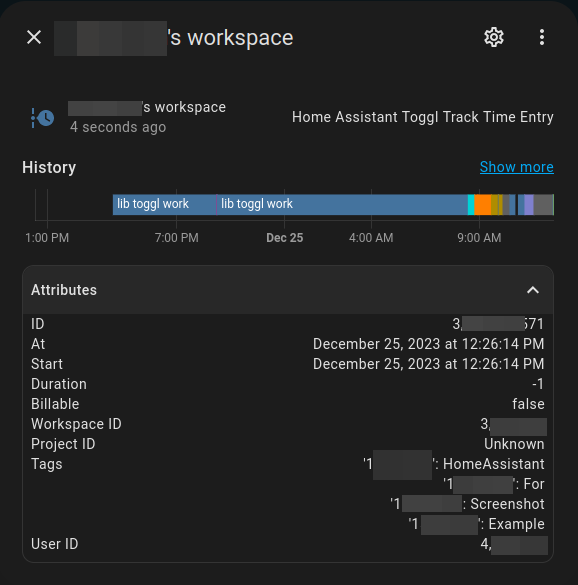
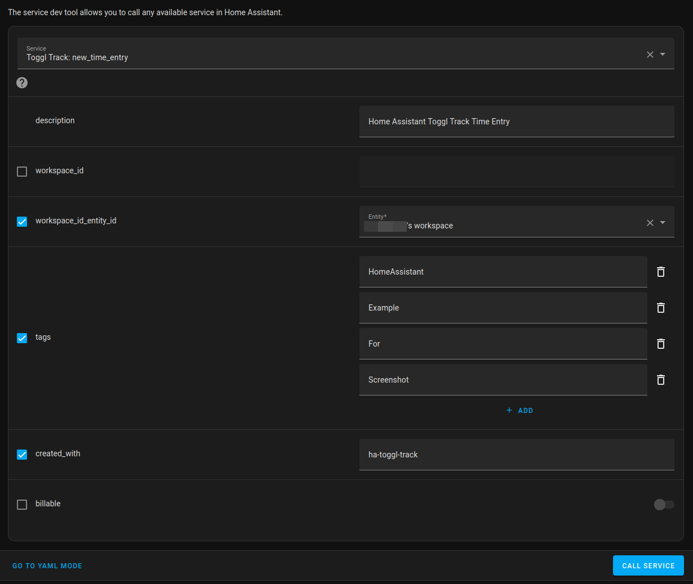
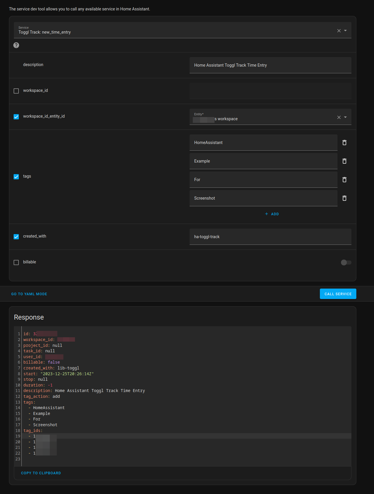
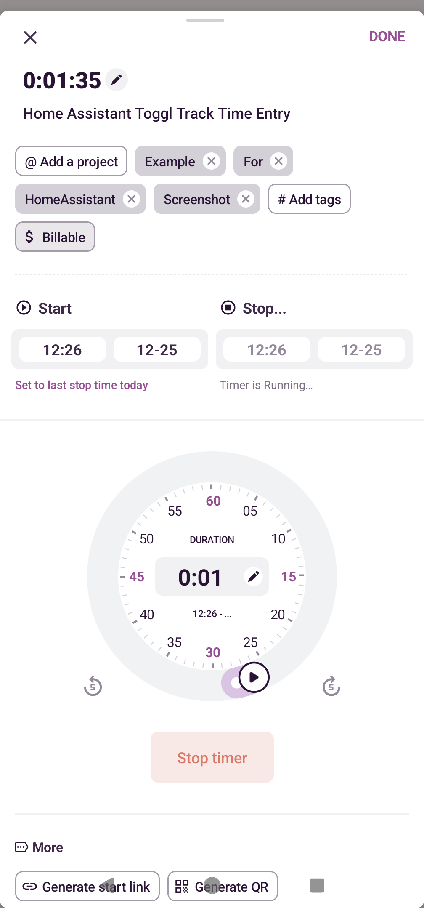

# Toggl Track for Home Assistant

> **NOTE:**
> **This is still a work in progress** but it's functional enough for my needs.
> I'll be adding more features as I need them.
> Feel free to open an issue or PR if you have any suggestions.

This is a custom component for [Home Assistant](https://www.home-assistant.io/) that integrates with [Toggl Track](https://toggl.com/track/).
This repo is mostly the glue code between the [lib-toggl](https://github.com/kquinsland/lib-toggl) library and Home Assistant.
Any issues with the Toggl API should be reported to the [lib-toggl](https://github.com/kquinsland/lib-toggl/issues) repo.

<!-- START doctoc generated TOC please keep comment here to allow auto update -->
<!-- DON'T EDIT THIS SECTION, INSTEAD RE-RUN doctoc TO UPDATE -->

- [Toggl Track for Home Assistant](#toggl-track-for-home-assistant)
  - [TODOs](#todos)
  - [Installation](#installation)
    - [HACS](#hacs)
    - [Manual](#manual)
  - [Using](#using)
    - [Sensors](#sensors)
    - [Services](#services)
      - [`toggl_track.new_time_entry`](#toggl_tracknew_time_entry)
      - [`toggl_track.stop_time_entry`](#toggl_trackstop_time_entry)

<!-- END doctoc generated TOC please keep comment here to allow auto update -->

## TODOs

- [ ] Proper version/release automation for HACS. As of now, it's just a git short hash with no real release notes ... etc.
- [ ] Fix issues with translations/strings; not sure why they're not working properly in config flow
- [ ] Other missing bits and pieces that are still needed to turn this into an official integration
- [ ] Tests. Lots and lots of tests to cover all sorts of things

## Installation

> **Note**
> As of _now_ `lib-toggl` can't be **safely** installed into Home Assistant via HACS.
> See [issue #1](https://github.com/kquinsland/ha-toggl-track/issues/1) for details on how to install it manually if you're so inclined.

### HACS

Add this repo to HACS as a custom repository and then the integration can be installed from the HACS UI.

You can click the button below to open this repository in HACS or you can [manually add it](https://hacs.xyz/docs/faq/custom_repositories/) via the HACS UI.

[](https://my.home-assistant.io/redirect/hacs_repository/?owner=kquinsland&repository=ha-toggl-track&category=integration)

This repo may eventually be added to the default HACS repository list but [only once it's more stable](https://hacs.xyz/docs/publish/include).
Until then, you'll need to add it as a custom repository using the instructions above.

### Manual

Copy the `custom_components/toggl_track` folder into your `custom_components` folder and restart Home Assistant.

If everything worked, you should see a message like this in your Home Assistant logs:

```log
WARNING (SyncWorker_2) [homeassistant.loader] We found a custom integration toggl_track which has not been tested by Home Assistant. This component might cause stability problems, be sure to disable it if you experience issues with Home Assistant
```

You can then add the integration via the UI.

## Using

After installing the integration, you'll need to add and configure it via the UI.

You will need to provide an API token and can optionally change how often the integration polls the Toggl Track API.
The default is 60 seconds and should be fine for most people but can be [adjusted](custom_components/toggl_track/config_flow.py#L40) as needed.

Assuming your API token works, you'll be shown a list of workspaces.
Unless you're a premium user, you'll only have one workspace.

For each workspace that you select, a sensor will be created.



> **Note**
> The icon for the integration will be the generic `icon not available` icon [this](https://github.com/home-assistant/brands/pull/5023) is merged.





### Sensors

> **Note**
> Each sensor requires POLLING the Toggl Track API.
> The default polling interval is 60 seconds.
> This means you _may_ see a delay of up to ~60 seconds between when you start/stop a time entry and when the sensor updates to reflect the change.
>
> **This delay does not impact the create/stop services**

The sensor will have the name/description for the current time entry for the account.
This means that you may have multiple sensors - one for each workspace - but only one of them will have a value at any given time. (**Note: Not quite correct; see [issue #4](https://github.com/kquinsland/lib-toggl/issues/4)**)

The sensor's `state` will be the description on the current time entry.
The `attributes` will contain the rest of the time entry data.



### Services

There are two services for creating a new Time Entry and for stopping the current Time Entry.
Both services can take either a [workspace/Time Entry sensor](#sensors) entity ID or manually specified values.

#### `toggl_track.new_time_entry`

This service will create a new Time Entry.
You can either manually specify the `workspace_id` or you can specify a [workspace/Time Entry sensor](#sensors) entity ID in the `workspace_id_entity_id` field.



```yaml
service: toggl_track.new_time_entry
data:
  description: Home Assistant Toggl Track Time Entry
  tags:
    - HomeAssistant
    - Example
    - For
    - Screenshot
  created_with: ha-toggl-track
  workspace_id_entity_id: sensor.your_toggl_acc_name_here_workspace
```

If the `workspace_id_entity_id` field is specified, the sensor must have a valid `workspace_id` in it's attributes.
As of _right now_ this is only possible when there is ALREADY a running time entry.
This is a known bug / should be addressed in the future.

If the time entry is created successfully, you'll get a response like this:



```yaml
id: 1234567890
workspace_id: 7654321
project_id: null
task_id: null
user_id: 1234567
billable: false
created_with: lib-toggl
start: "2023-12-25T20:26:14Z"
stop: null
duration: -1
description: Home Assistant Toggl Track Time Entry
tag_action: add
tags:
  - HomeAssistant
  - Example
  - For
  - Screenshot
tag_ids:
  - 12345727
  - 12345728
  - 12345729
  - 12345730
```

And using another Toggl Track client, you'll see the new time entry



#### `toggl_track.stop_time_entry`

Docs for this service are coming soon; operates similar to the create time entry service, though.

#### `toggl_track.edit_time_entry`

Similar to [`new_time_entry`](README#`toggl_track.new_time_entry`) but meant for editing an existing time entry.

Internally, the Toggle API allows editing virtually every aspect of a time entry but I've chosen to only expose the `description` and `tags` fields for now as my use case doesn't require anything else.

This service will create tags if they do not yet exist in the workspace so you're free to add new tags as needed and not worry about creating them first.

This service will remove tags if needed but it will not delete them.

```yaml
service: toggl_track.edit_time_entry
data:
  description: Cleaning the house
  tags: tag1,tag2,tag3
  workspace_id_entity_id: sensor.your_toggl_track_workspace_name
  workspace_id: 1234567
  time_entry_id: 1234567
```
